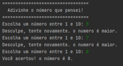
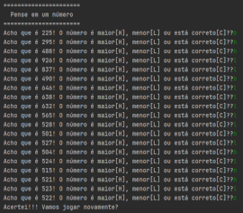
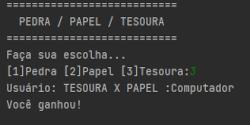

# Jogos em Linguagem Python 
Jogos simples em Python TKinter 

## Adivinha o Número
* Neste exercício o usuário tentará adivinhar o número que o computador pensou 

## Computador Adivinha o Número
* Neste exercício o computador tentará adivinhar o número que o usuário pensou 

## Pedra / Papel / Tesoura
* Famoso JO-KEN-PO! 

